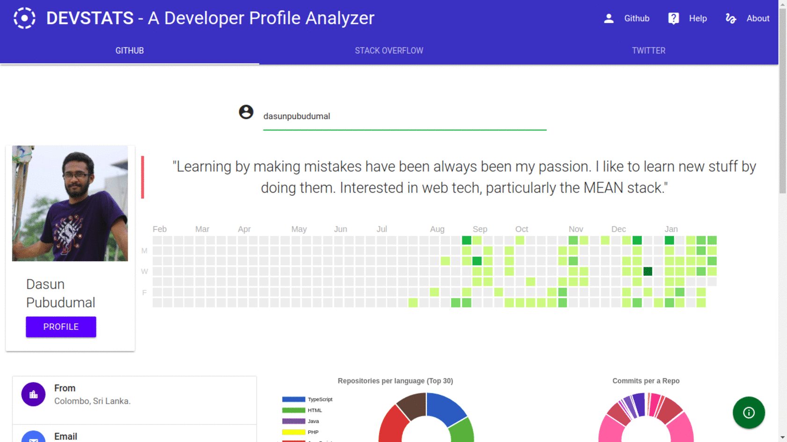

# Github + Stack + Twitter Profile Analyzer with Angular + Spring

A simple profile analyzer for developers. **You can follow a thorough walkthrough through this application by visiting my series of blogposts starting from [this.](https://dasunpubudu.wordpress.com/2018/01/13/creating-a-github-profile-analyzer-with-spring-boot-angular-part-i-introduction/)**

*Note* - This *README* consists of only the implementation details for **GitHub** profile search. However, this project was chosen as my *Semester V Project* and hence, I've extended it to *StackOverflow* and *Twitter* profile searches to give a better scope. For implementation details and help on the extended components, **please refer to the [wiki](https://github.com/dasunpubudumal/spring-github-repo/wiki) page**.

## High Level Architecture


## Screenshot GIF




_Application when ran through my Github profile_.

## Prerequesits

* Angular-CLI installed. ( You can install it by running ``sudo npm install -g @angular/cli`` ).
* JDK (Java Development Kit)
* Node.js  (npm)

## Usage

1. Clone the repository using `git clone` (Or any other method i.e. using an IDE) and open the project folder, import the maven dependencies.
2. Enable Auto-import if you are in IntelliJ and if you are in Visual Studio Code, there is a handy plugin which I will state [here](https://marketplace.visualstudio.com/items?itemName=georgewfraser.vscode-javac). It will automatically build the application and import the maven dependencies.

3. Install front end dependencies for Angular by running `npm install` in the `/client` folder.

4. Register an application in Github, Stackexchange, and Twitter and obtain your credentials.

5. Start the front end server by running `ng serve` . Make sure you're in `/client` folder.

6. Create a package called `config` in `com/springgithub/springgithub` directory.

7. Create a `Configuration` class and fill out these data using the credentials you've obtained by registering your application in step 4.

```java
package com.springgithub.springgithub.config;

public class Configuration {
   
   // Github
    public static final String GITHUB_CLIENT_ID = "";
    public static final String GITHUB_CLIENT_SECRET = "";
    public static final String GITHUB_TOKEN = "";
    
    //    Stack Overflow
    public static final String STACK_KEY = "";
    public static String SITE = "stackoverflow";
    
    //    Twitter
    public static final String TWITTER_CONSUMER_KEY = "";
    public static final String TWITTER_CONSUMER_SECRET = "";
    public static final String TWITTER_ACCESS_TOKEN = "";
    public static final String TWITTER_ACCESS_TOKEN_SECRET = "";
}

```
You must get a personal access token from github.

8. Create a `CacheConfig` class and add this this bean configuration for server side caching.

```java
package com.springgithub.springgithub.config;

import org.springframework.cache.CacheManager;
import org.springframework.cache.concurrent.ConcurrentMapCacheManager;
import org.springframework.context.annotation.Bean;
import org.springframework.context.annotation.Configuration;

@Configuration
public class CacheConfig {

    @Bean
    public CacheManager cacheManager() {
        return new ConcurrentMapCacheManager("" +
                "commits", "user");
    }

}

```

9. Change `spring.data.mongodb.uri` to a registered database URI in mLabs.

9. Run the backend Tomcat server from IntelliJ (Press Run, or `mvn spring-boot:run` in the console; to do this you must have `maven` downloaded and configured in your `PATH`. Otherwise, run `SpringGithubApplication.java` which is the `main` method of the application.)

10. Open the served front end at port `4200` (Default Angular port).

**NOTE: An external MongoDB database is used for caching purposes in GitHub commits.**

## Acknowledgements

* [Eclipse Software Foundation](http://www.eclipse.org/org/) for their [EGit](https://github.com/eclipse/egit-github/tree/master/org.eclipse.egit.github.core) adapter.
* [Yusuke Yamamoto](https://github.com/yusuke) for his [twitter-4j](https://github.com/yusuke/twitter4j) adapter.
* [Sanjiv Singh](https://github.com/sanjivsingh) for his [stackoverflow-java-sdk](https://github.com/sanjivsingh/stackoverflow-java-sdk) library.
* [Valor Software Foundation](https://valor-software.com/ng2-charts/) for their [ng2-charts](https://github.com/valor-software/ng2-charts) wrapper for _Chart.js_.
* [InfoMediaLtd](https://github.com/InfomediaLtd) for their [angular2-materialize](https://github.com/InfomediaLtd/angular2-materialize) wrapper for MaterializeCSS. 
* [In28Minutes](http://www.springboottutorial.com/unit-testing-for-spring-boot-rest-services) for their Unit Testing (Based on JUnit and Mockito) blogpost. 
* [Oshervoe's book](https://www.goodreads.com/book/show/6487349-the-art-of-unit-testing) for a great deal of knowledge on Unit Testing.
* [Lukasz Goslawski](https://github.com/lokers) for his [ng-4-twitter-timeline](https://www.npmjs.com/package/ng4-twitter-timeline) NPM module.


